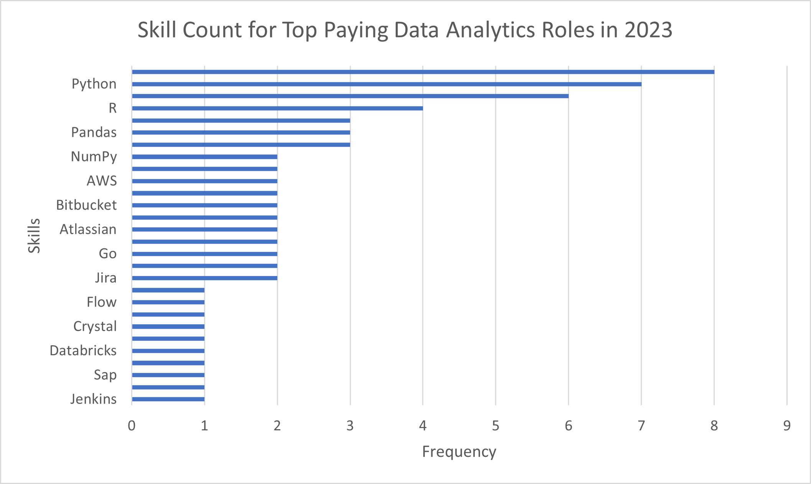

# Overview & Purpose
This project explores data analytics job market trends using SQL.
The dataset provides real-world job postings, salaries, and skill requirements, allowing us to analyze demand and salary distributions for Data Analyst roles.

Through five focused SQL queries, the project answers:

1. What are the top-paying data analyst jobs?  
→ Identifies the highest-paying roles and the companies offering them.

2. What skills are required for the top-paying data analyst jobs?  
→ Reveals the technical skills and tools associated with high-paying positions.

3. What are the most in-demand skills for data analysts?  
→ Highlights which skills appear most frequently in job postings.

4. What are the top skills based on salary?  
→ Evaluates how specific technical skills impact earning potential.

5. What are the most optimal skills to learn (high demand + high salary)?  
→ Pinpoints skills that offer both strong demand and financial rewards.

Each query was executed using PostgreSQL and then analyzed visually in Excel for clear presentation.    

# Dataset
- Dataset Source: [Google Drive Link to Dataset](lukeb.co/sql_project_csvs)
- SQL Scripts to Recreate Tables and Load Data: [SQL Files Repository Link](sql_load)
- The Entity Relationship Diagram (ERD) for the dataset used:
  

# The Analysis
### 1. Top-Paying Data Analyst Jobs

Query: [1_top_paying_jobs.sql](SQL_project/1_top_paying_jobs.sql)  

Objective: Identify the top-paying Data Analyst positions and understand salary patterns.

Insights:
- Wide Salary Range: The top 10 paying data analyst roles span from $184,000 to $650,000, showing a large variation based on seniority and specialization.
- Diverse Employers: Companies like SmartAsset, Meta, and AT&T are leading in compensation, indicating strong analytics adoption across different industries.
- Role Diversity: Job titles range from Data Analyst to Director of Analytics and Principal Analyst, highlighting multiple career paths and levels within analytics.

### 2. Skills Required for Top-Paying Data Analyst Jobs

Query: [2_top_paying_job_skills.sql](2_top_paying_job_skills.sql)  

Objective: Discover which skills are demanded in high-paying positions.

Insights:
- Comprehensive Skill Set: The top-paying position demands a mix of programming (Python, R), data management (SQL, Pandas), and big data tools (PySpark, Databricks).
- Cloud Expertise: Skills like AWS and Azure appear among the top requirements, reflecting the increasing integration of cloud technologies in data roles.
- Analytical Ecosystem: Tools like Jupyter and Excel indicate that both modern and traditional data tools continue to hold importance.

### 3. Most In-Demand Skills for Data Analysts

Query: [3_top_demanded_skills.sql](SQL_project/3_top_demanded_skills.sql)  

Objective: Identify which skills are most frequently required across job postings.

Insights:
- SQL Dominance: With over 92,000 mentions, SQL remains the most essential skill for any data analyst role.
- Foundational Tools: Excel still holds a strong position, highlighting its continued relevance in day-to-day analytics.
- Programming Importance: Python ranks third, reflecting the growing shift toward automation, scripting, and machine learning in analytics.
- Visualization Demand: Tableau and Power BI round out the top 5, reinforcing the need for strong data storytelling and presentation abilities.
- Balanced Skill Profile: The top skills span data extraction, analysis, and visualization, defining the core competencies of modern data analysts.

### 4. Top Skills Based on Salary

Query: [4_top_paying_skills.sql](4_top_paying_skills.sql)  

Objective: Determine which technical skills command the highest salaries.

Insights:
- High-End Technical Tools: Skills like PySpark ($208K) and Bitbucket ($189K) command top salaries, showing strong value for advanced data and engineering capabilities.
- Emerging Technologies: Platforms such as DataRobot and Watson appear among high-paying skills, indicating rising demand for AI and automation-focused expertise.
- Cross-Functional Tools: Development-related tools like GitLab and Bitbucket signal the increasing overlap between analytics and software engineering.
- Advanced Analytics Edge: Mastery of tools like Jupyter and Pandas suggests that hands-on data manipulation and workflow automation directly influence earning potential.

### 5. Most Optimal Skills to Learn (High Demand + High Pay)

Query: [5_optimal_skills.sql](5_optimal_skills.sql)  

Objective: Find skills that balance both salary growth and job demand.

Insights:
- Cloud & Big Data Priority: Tools like Snowflake, Azure, AWS, and BigQuery dominate the optimal skill set, reflecting the migration of analytics workloads to the cloud.
- Engineering-Focused Advantage: Skills such as Go and Hadoop are highly paid and increasingly valuable for scalable data infrastructure roles.
- Strategic Upskilling Areas: Focusing on cloud data platforms offers both job security and salary growth, making them ideal skills for aspiring analysts.
- Industry Trend: The convergence of data analysis, cloud systems, and data engineering defines the most rewarding upskilling path in 2023.

# The Conclusion
Across all five analyses:  
- SQL and Python form the foundational layer of data analytics.  
- Cloud and Big Data tools (Azure, AWS, Snowflake, Hadoop) are the next frontier for higher salaries.  
- Visualization and reporting (Tableau, Power BI) remain core for business-facing roles.  
- The most optimal skill set lies in mastering both analytical and technical aspects — from querying and modeling to deploying data pipelines.  
This project demonstrates how structured SQL analysis can translate raw job market data into actionable insights for career development.  

# Tools Used & Skills Demonstrated
- SQL Tools: PostgreSQL, SQLite  
- Development Environment: VS Code  
- Version Control: Git & GitHub  
- Visualization Tools: Excel (for charts, formatting, and dashboards)  
- Skills Demonstrated:  
    - Data cleaning, filtering, and aggregation  
    - Subqueries and CTEs      
    - Joins across multiple tables      
    - Grouping and ranking logic      
    - SQL-to-insight storytelling

# References
I learnt everything about SQL from [THIS](https://www.udacity.com/course/sql-for-data-analysis--ud198) free course on Udacity and built this project with the help of [Luke Barousse](https://www.youtube.com/@LukeBarousse) following [THIS](https://youtu.be/7mz73uXD9DA?si=VBALiyjn4SJweOqr) YouTube video. 

